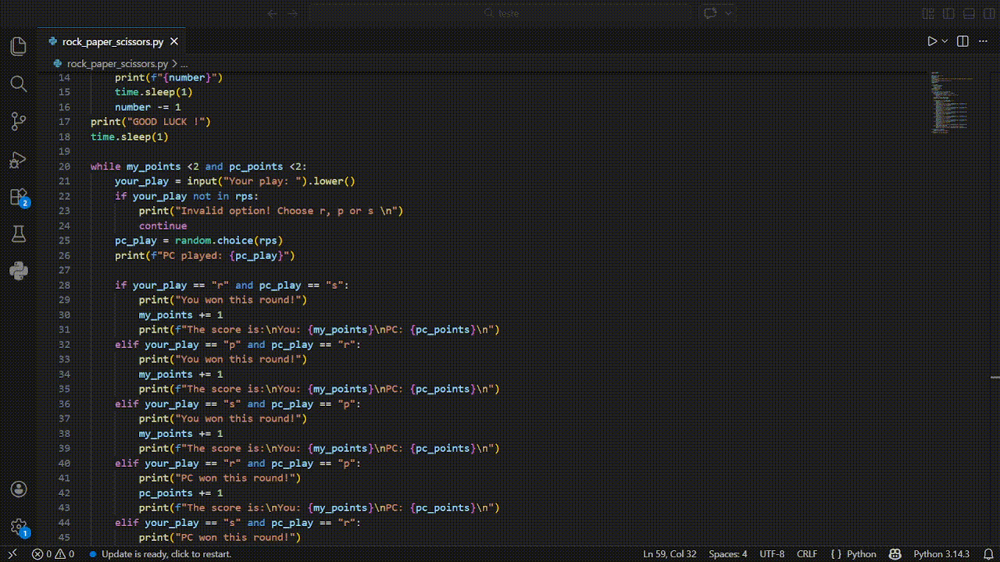

# 🎮 Rock Paper Scissors - Python

A simple Rock Paper Scissors game built with Python where the player competes against the computer.

## 🚀 Features

- Countdown before the game starts
- Random computer choices
- Score system
- Input validation
- First to reach 2 points wins

## 🛠️ Technologies Used

- Python
- Random module
- Time module

## ▶️ How to Run

1. Clone the repository
git clone https://github.com/joaoleaodev/rock-paper-scissors-python.git

2. Navigate to the folder
cd rock-paper-scissors-python

3. Run the program
python main.py

## 🎮 Game Rules

- `R` = Rock  
- `P` = Paper  
- `S` = Scissors  

First player to reach **2 points wins the game**.

## 📚 What I Learned

This project helped me practice:

- Python loops (`while`)
- Conditional statements (`if/elif`)
- Lists
- Random choices
- Input validation

## 🎥 Project Preview

## 👨‍💻 Author

**João Vitor Pontes Leão** 
- LinkedIn: https://www.linkedin.com/in/joaoleaodev

---

⭐ If you liked this project, feel free to give it a star!
